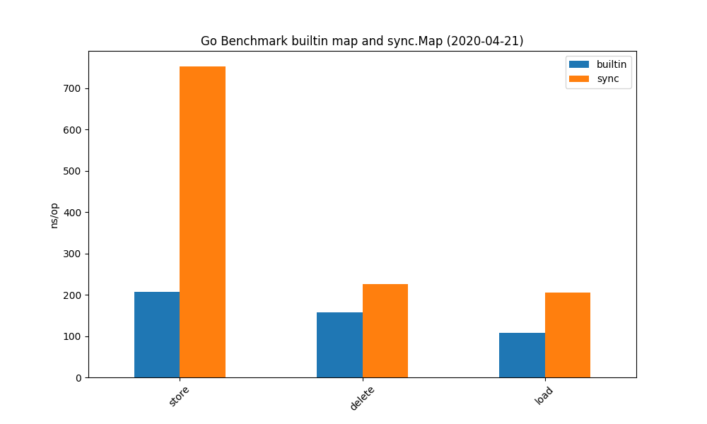

# Benchmarking Go's standard `map` against `sync.Map`

## about://sync.Map

> ```go
> type Map struct {
>   // contains filtered or unexported fields
> }
> ```
>
> Map is like a Go map[interface{}]interface{} but is safe for concurrent use by
> multiple goroutines without additional locking or coordination. Loads, stores,
> and deletes run in amortized constant time.
>
> The Map type is specialized. Most code should use a plain Go map instead, with
> separate locking or coordination, for better type safety and to make it easier
> to maintain other invariants along with the map content.
>
> The Map type is optimized for two common use cases: (1) when the entry for a
> given key is only ever written once but read many times, as in caches that
> only grow, or (2) when multiple goroutines read, write, and overwrite entries
> for disjoint sets of keys. In these two cases, use of a Map may significantly
> reduce lock contention compared to a Go map paired with a separate Mutex or
> RWMutex.
>
> The zero Map is empty and ready for use. A Map must not be copied after first
> use.

## A simple Benchmark

```bash
▶ sysctl -a | grep machdep.cpu
machdep.cpu.vendor: GenuineIntel
machdep.cpu.brand_string: Intel(R) Core(TM) i9-9980HK CPU @ 2.40GHz
machdep.cpu.family: 6
machdep.cpu.logical_per_package: 16
machdep.cpu.cores_per_package: 8
```

```bash
▶ go test -bench=. ./...
?       embano1/go-meetup-lej-04-2020/sync/sync-map     [no test files]
goos: darwin
goarch: amd64
pkg: embano1/go-meetup-lej-04-2020/sync/sync-map/stdmap
BenchmarkStoreStandardMap-16             6787827               208 ns/op
BenchmarkStoreSyncMap-16                 2295744               559 ns/op
BenchmarkDeleteRegular-16               10180906               156 ns/op
BenchmarkDeleteSync-16                   6682532               205 ns/op
BenchmarkLoadRegularFound-16            15646496               103 ns/op
BenchmarkLoadSyncFound-16                6910916               233 ns/op
PASS
ok      embano1/go-meetup-lej-04-2020/sync/sync-map/stdmap      27.536s

```



> **Disclaimer:** Heavily inspired by [The new kid in town — Go’s sync.Map](https://medium.com/@deckarep/the-new-kid-in-town-gos-sync-map-de24a6bf7c2c)